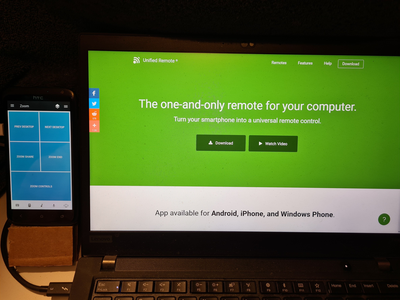

= Unified Remote for Zoom
ellipticview
:doctype: article
:encoding: utf-8
:lang: en
:toc: left
:numbered:

== Introduction

If you have an old mobile phone that you want to put to use, then this project allows you to repurpose it as a custom keypad. A cheaper version of the Elgato Stream Deck.

The image below shows my desk setup, with an old mobile phone to the left of my screen:

I created a stand from carton, but an alternative is the Ikea SIGFINN holder.

When working from home, I am usually connected via VPN to a corporate network. This means that the mobile phone cannot communicate with my laptop via WiFi. The remaining alternatives are:

- USB
- Bluetooth

There are quite a few Android apps that allow you to use your phone as a programmable keypad, but the only one I have found that meets the above criteria (bluetooth) is https://www.unifiedremote.com/[Unified Remote]. As this is a custom remote, you will require the full (paid) version of the app.

== Functionality
This remote provides you with a keypad that looks like this:

[width="40%"]
|====================
| Prev Desktop | Next Desktop 
| Zoom Share | Zoom End
2+^|Zoom Controls
|====================

The top two keys allow you to switch between Windows virtual desktops.

I often find that my Zoom window is hidden below other windows. The bottom key (Zoom Controls) moves the focus to the Zoom window.

== Installing

These instructions assume you have your Unified remote working and connected to your computer. A useful remote to try out is the Media remote. If that works, you are good to go.

Copy all files in the `zoom` folder into folder: `C:\ProgramData\Unified Remote\Remotes\Custom\zoom`

On your computer, find the Unified Remote icon on the taskbar (the hidden icons on the right). Right-click and choose `Manager ...`.
This starts a browser screen titled *Status*.
On the bottom of the screen, hit the button `RELOAD REMOTES`.
Unfortunately, this doesn't reload the remotes. You have to hit the `RESTART SERVER` button.

On the menu on the left of the screen, choose *Remotes*. Scroll down and check that Zoom is in the list.

Start the app on your phone. You will see the screen titled *Remotes* and listing `Basic Input` as the first one.

On the bottom left you will see a refresh icon. Press it to refresh the list. Zoom won't be on the list yet. Then hit the green (+) button on the screen. It shows several categories. Press *Other*. Press *Zoom*. Now Zoom will be displayed in the Remotes list.

== Preferences

=== Power
You'll want your remote to stay activated while you are at your laptop; you don't want your phone to go to sleep.

. Press the pancake menu in the top left corner.
. Choose *Preferences*
. Choose *Power*
. Select the checkbox on *Wake Lock*.

=== Quick Switch
When a remote is activated, you can quickly switch to another remote by swiping from the right side of the screen. Follow these steps to add Zoom the Quick Switch menu.

. Press the pancake menu in the top left corner.
. Choose *Preferences*
. Choose *General*
. Choose *Quick Switch*
. Select the checkbox on the Zoom remote and press OK.

== Files in the Zoom folder
Here's a brief description of the files, for those that may want to modify them:

[width="100%",options="header"]
|====================
| Filename | Description 

| icon.png
| Icon with 64x64 pixels resolution

| icon_hires.png
| Icon with 512x512 pixels resolution

| layout.xml
| The file that describes the layout

| meta.prop
| Describes the metadata of this remote

| remote.lua
| Defines the keyboard mappings
|====================